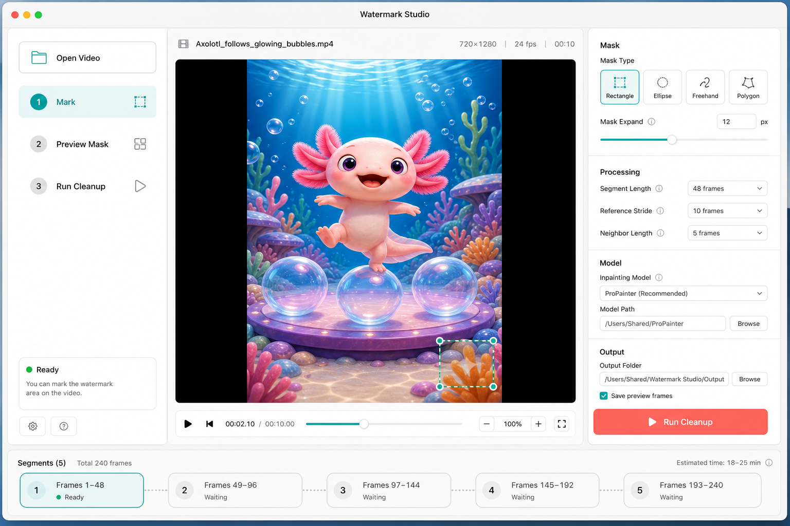

# Watermark Studio

[中文说明](README.zh-CN.md)

Watermark Studio is a developer-friendly toolkit for cleaning watermarks from videos you own or have permission to process. It combines a Python CLI, reusable masking/compositing utilities, a ProPainter backend adapter, and a native macOS app for visually marking the cleanup area.

The workflow is simple: open a video, mark the watermark, run a video inpainting backend, and rebuild the final mp4 with the original audio preserved.

The current backend adapter targets [ProPainter](https://github.com/sczhou/ProPainter). Point the CLI or macOS app at a local ProPainter checkout to run cleanup jobs with that backend.

## Status

Watermark Studio is currently a developer preview. The CLI and macOS app are usable for local workflows, but the macOS app is not signed or notarized yet.

## Features

- `watermark-studio` Python CLI.
- Rectangle and polygon mask generation.
- ROI cropping and scaled repair compositing for faster ProPainter backend runs.
- ffmpeg/ffprobe helpers for frame extraction and final mp4 rebuilds.
- Native macOS SwiftUI app for visual marking, parameter tuning, and cleanup execution.
- Environment diagnostics through `watermark-studio doctor`.
- CI coverage for Python tests on macOS/Linux and Swift tests on macOS.

## Interface Preview

The macOS app provides a visual workflow for opening a video, marking the cleanup mask, previewing the mask, choosing speed/quality presets, and opening the completed output.



## Requirements

- macOS or Linux for the CLI.
- macOS 14+ for the SwiftUI app.
- `ffmpeg` and `ffprobe` on `PATH`.
- Python 3.10+ with OpenCV and NumPy.
- A working ProPainter checkout and environment. Watermark Studio provides the orchestration layer; ProPainter code, weights, and runtime dependencies follow the upstream project.

Check your local environment:

```bash
watermark-studio doctor \
  --python python3 \
  --propainter-dir /path/to/ProPainter
```

Recommended ProPainter flags for short generated-video clips:

```bash
--mask_dilation 0 \
--neighbor_length 5 \
--ref_stride 10 \
--subvideo_length 12 \
--raft_iter 10 \
--save_frames
```

ProPainter's own temporary mp4 writing can fail in some PyAV environments while the repaired frames are already saved. Watermark Studio treats saved frames as the source of truth and uses ffmpeg to rebuild the final mp4.

## Install CLI For Development

```bash
cd /path/to/watermark-studio
python3 -m pip install -e .
```

If your OpenCV environment is in Conda, use that Python:

```bash
/path/to/conda/bin/python -m pip install -e .
```

For tests and development helpers:

```bash
python3 -m pip install -e ".[dev]"
pytest -q
```

## CLI Usage

Probe a video:

```bash
watermark-studio probe input.mp4
```

Extract a frame to mark:

```bash
watermark-studio preview-frame input.mp4 preview.png --at 0
```

Check required tools:

```bash
watermark-studio doctor --python python3 --propainter-dir /path/to/ProPainter
```

Clean a video with a rectangle mask:

```bash
watermark-studio clean input.mp4 output.mp4 \
  --propainter-dir /path/to/ProPainter \
  --python /path/to/python \
  --rect 560,1128,80,72 \
  --expand 3 \
  --segment-frames 48 \
  --keep-work
```

Clean with a polygon mask:

```bash
watermark-studio clean input.mp4 output.mp4 \
  --propainter-dir /path/to/ProPainter \
  --polygon "596,1128;612,1147;639,1151;621,1169;629,1202;600,1182;535,1210;576,1172;550,1160;581,1147" \
  --expand 3
```

Use rectangle masks for regular watermarks. Use polygon masks for small or irregular watermarks. Keep the mask tight first, then increase `--expand` only when edges still remain.

## macOS App

The macOS app lives in `macos/WatermarkStudio`.

Development run:

```bash
cd macos/WatermarkStudio
swift run WatermarkStudioMac
```

Build a local unsigned `.app`:

```bash
cd /path/to/watermark-studio
./scripts/package_mac_app.sh
open "dist/Watermark Studio.app"
```

Current app features:

- Open a video.
- Extract and show the first frame.
- Drag and resize a rectangle over the watermark.
- Draw a pen/polygon mask for small or irregular watermarks.
- Zoom into the frame while marking.
- Preview the final mask.
- Adjust mask expansion and ROI padding.
- Choose `Fast`, `Balanced`, or `Quality` cleanup presets.
- Configure and persist ProPainter path, Python path, and output path.
- Auto-generate unique output names and open/reveal completed videos.
- Run the CLI and stream progress logs.

The packaged app includes the `watermark_studio` Python package in app resources, but it still uses your system Python and external ProPainter checkout.

See [Quickstart](docs/quickstart.md) for a full local setup.

Before contributing, read [CONTRIBUTING.md](CONTRIBUTING.md). For sensitive reports, see [SECURITY.md](SECURITY.md).

## Speed Presets

The macOS app exposes three ProPainter presets:

- `Fast`: ROI 128, half-resolution inpainting, then composited back into the original video. Good for first-pass checks.
- `Balanced`: ROI 256, full-resolution inpainting. Recommended default for many generated-video watermarks.
- `Quality`: full-frame, slower and more conservative when the repaired area has foreground motion.

For maximum speed, use the smallest accurate mask. Oversized masks are slower and usually smear more detail.

## Suggested GitHub Roadmap

- Add backend presets for ProPainter, OpenCV Telea, and LaMa/other image inpainting.
- Add batch mode from the macOS app.
- Package a signed `.app` and optional bundled Python environment.
- Add visual QC contact sheet generation after every run.
- Parse segment logs into a real percent progress indicator.

## Ethics And Scope

Use this tool only on videos you own, videos you generated, licensed material, or videos where you have permission to remove embedded marks. The repo is meant for cleaning your own generated or licensed production assets.
